# 15 Frontend Concepts Every Senior Dev Has Mastered

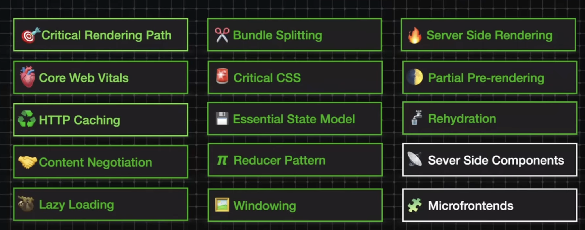

15 Frontend Concepts Every Senior Dev Has Mastered

## 1. The Critical Rendering Path (CRP)

The steps the browser takes to convert HTML, CSS, and JavaScript into pixels on the screen.

### CRP Steps

1. **DOM Construction**: Parse HTML into a tree structure (DOM)
2. **CSSOM Construction**: Parse CSS into a tree structure (CSSOM)
3. **Render Tree**: Combine DOM and CSSOM to create the render tree (only visible elements)
4. **Layout**: Calculate exact position and size of each element (reflow)
5. **Paint**: Convert render tree nodes into actual pixels on screen
6. **Composite**: Layer multiple paint operations for final display

**Render-Blocking Resources**: CSS blocks rendering until fully parsed. JavaScript blocks parsing unless marked as `async` or `defer`.

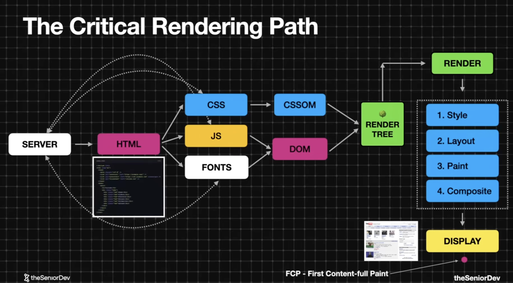
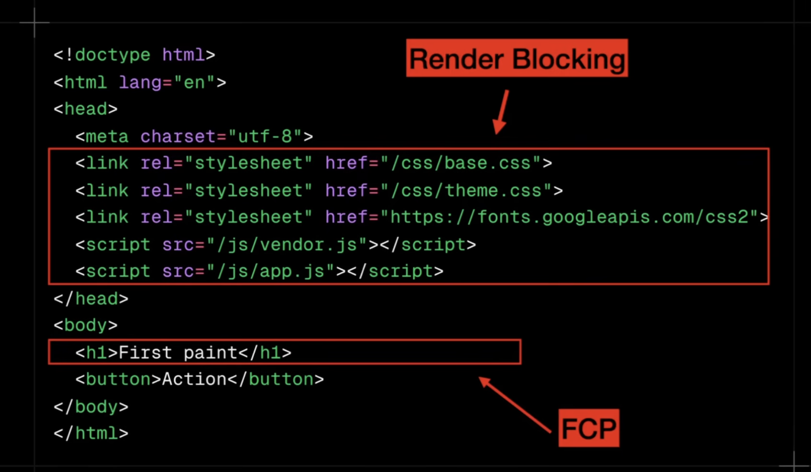

> 💡 **Senior Developer Tip 1**: Don't jump to framework talk immediately (like React). Focus on the underlying principles first (e.g., browser mechanics), and use frameworks as an implementation example.

## 2. Core Web Vitals (CWV)

Empirical metrics that measure how fast a page loads (CRP) and how fast it responds to input.

### The Three Core Metrics

- **LCP (Largest Contentful Paint)**: Measures loading performance. Marks when the largest content element becomes visible. Good: < 2.5s
- **INP (Interaction to Next Paint)**: Measures responsiveness. Time from user interaction to visual feedback. Good: < 200ms
- **CLS (Cumulative Layout Shift)**: Measures visual stability. Quantifies unexpected layout shifts. Good: < 0.1

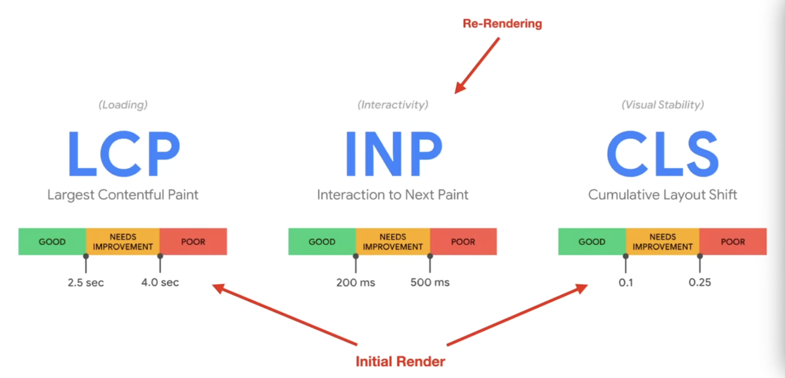
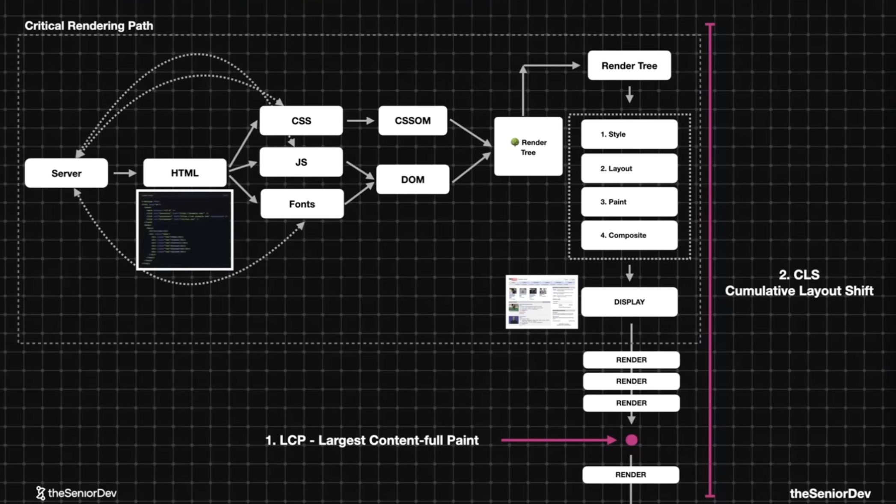
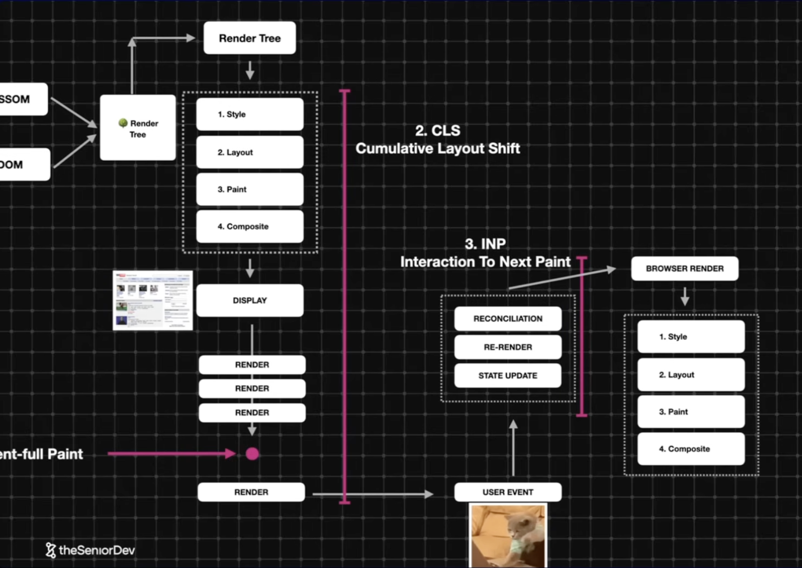

## 3. HTTP Caching

> Caching in general is a pattern based on a core mental model named Memoization

**Memoization**: Reusing the output of an operation for future queries with the same input

**Caching (file level)**: Reusing a file (JS, CSS) for a predefined time after first receiving it (TTL)

**TTL (Time to Live)**: The time we should consider a cached asset "fresh"

### HTTP Caching

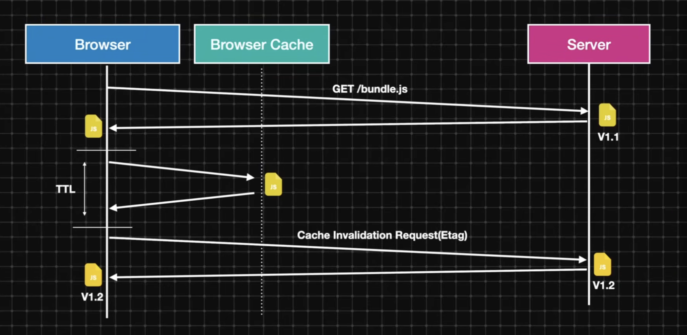

**Cache Control Headers**: TTL is managed by the `Cache-Control` header (not cache-tag). Common directives:

- `max-age=<seconds>`: How long the resource is fresh
- `no-cache`: Must revalidate with server before using
- `no-store`: Never cache the resource
- `public/private`: Can be cached by CDN or only by browser

**ETag**: Validates if cached resource is still current without re-downloading

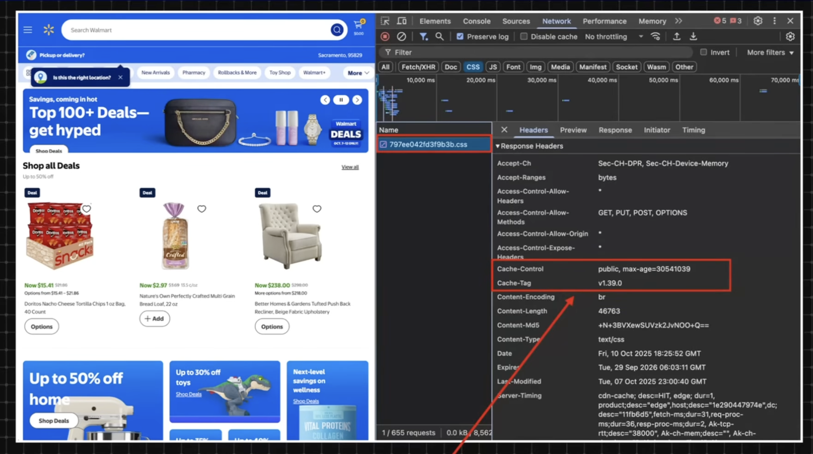

We don't usually set the caching policy ourselves, because most times our CDN will do it for us.

**CDN (Content Delivery Network)**: Distributes static assets to "edge locations" across the globe for fast access with out-of-the-box efficient cache policies and compression (content negotiation).

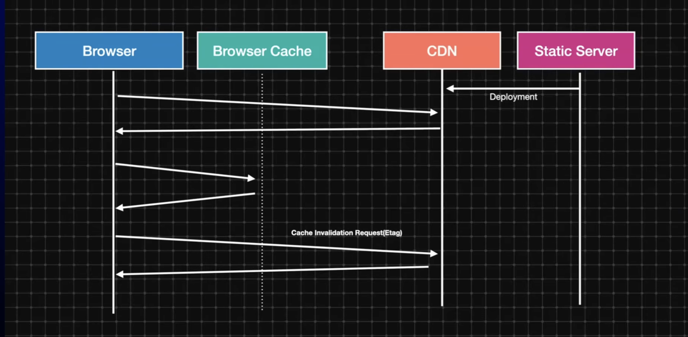

## 4. Content Negotiation

The process where the client and server negotiate the best format for data transfer using HTTP headers.

**Key Headers**:

- `Accept`: Client specifies preferred content types (e.g., `application/json`)
- `Accept-Encoding`: Client specifies supported compression (e.g., `gzip`, `brotli`)
- `Accept-Language`: Client specifies language preferences

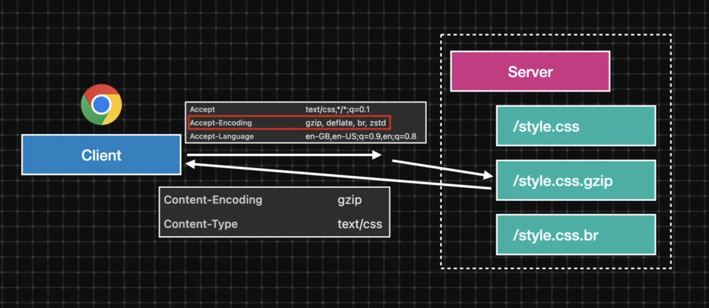

> It's cheaper to decompress content than to download uncompressed files. Brotli compression can reduce file sizes by 70%+.

> 💡 **Senior Developer Tip 2**: Senior Frontend Developers are expected to have good fundamentals of the data layer: HTTP, REST, GraphQL, SSE & WebSockets.

## 5. Lazy Loading

A performance optimization technique that defers loading of non-critical resources until they're actually needed.

**Eager loading**: Load/fetch everything at once.
**Lazy loading**: Load assets when they are needed (user actions like scroll, navigate, new page)

### Lazy Loading Types

1. **Image Lazy Loading**: Use `loading="lazy"` attribute or Intersection Observer to load images as they approach viewport
2. **Route-based Code Splitting**: Load JavaScript bundles only when navigating to specific routes
3. **Component-level Splitting**: Defer loading of heavy components (modals, charts) until needed
4. **Below-the-fold Content**: Delay loading content not immediately visible on page load

**Use Cases**: Image galleries, infinite scroll feeds, modal dialogs, admin panels, analytics scripts

#### For JavaScript, we rely on different imports

**Static import: Import js script at "build time":**

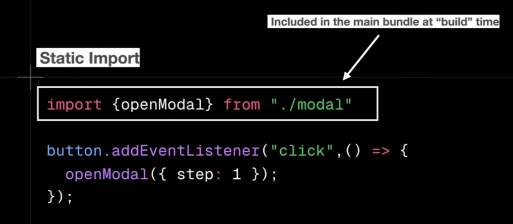

**Dynamic import: Import a js script at "run time":**

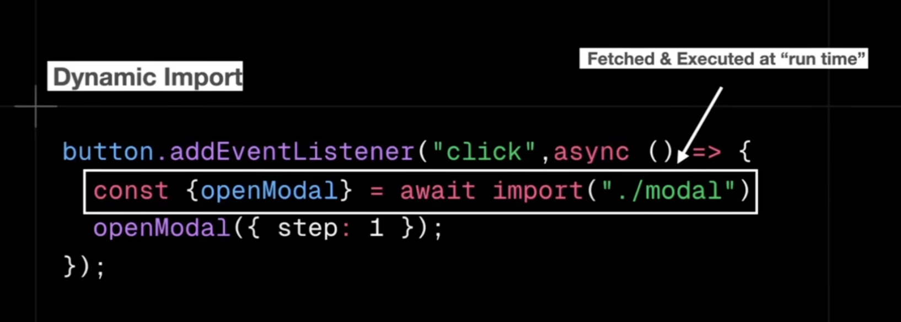

## 6. Bundle Splitting

**Traditional Module Bundler**: Combines all modules into a single bundle
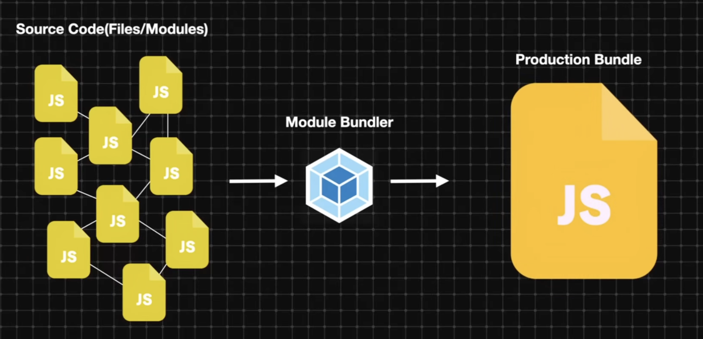

**With Bundle Splitting**: Intelligently separates code into multiple bundles

- **Vendor bundles**: Third-party dependencies (changes infrequently)
- **App bundles**: Your application code (changes frequently)
- **Route bundles**: Code per route (lazy loaded)
- **Shared bundles**: Common code across routes

**Benefits**: Better caching, parallel downloads, faster initial loads


> 💡 **Senior Developer Tip 3**: Think in systems, components and relationships rather than memorizing separate concepts

## 7. Critical CSS

CSS is render-blocking by design, so the browser must compute all CSS before continuing to render the page.

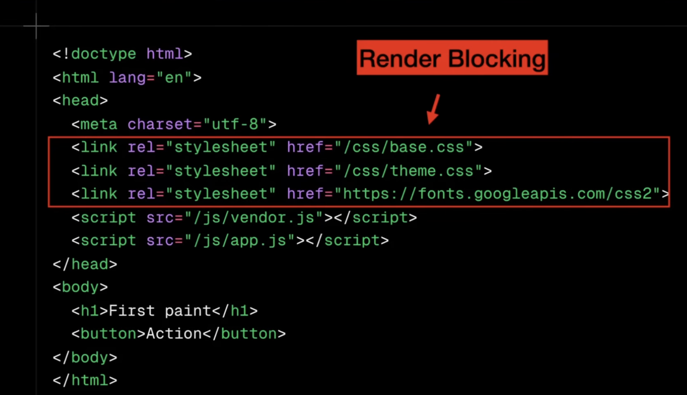

**Solution**: Focus on CSS "Above the Fold" - inline only the styles needed for initial viewport rendering.

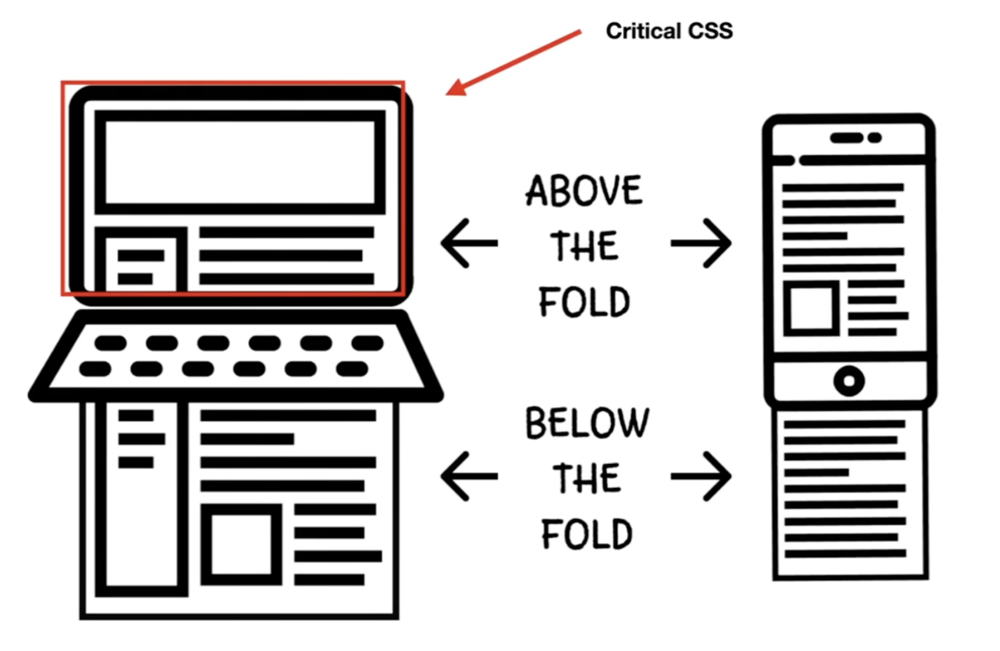

### Critical CSS Extraction

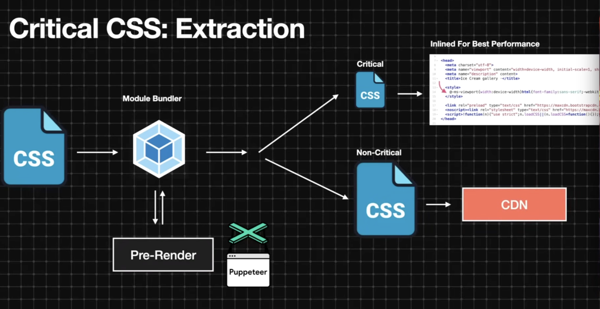

**Tools for Critical CSS**:

- **Critical**: npm package that extracts and inlines critical CSS
- **Critters**: Webpack plugin for critical CSS extraction
- **PurgeCSS**: Removes unused CSS, often paired with critical extraction
- **Next.js/Gatsby**: Built-in automatic critical CSS handling

**Tailwind CSS Advantage**: Utility-first approach generates only the CSS classes you use. With JIT (Just-In-Time) mode, it produces minimal CSS bundles naturally, reducing the critical CSS problem. No unused styles = smaller critical CSS footprint.

### CSS Extraction in Next.js

Next.js automatically handles critical CSS extraction with zero configuration:

- **Built-in Optimization**: Automatically inlines critical CSS in the `<head>` during server-side rendering
- **Automatic Code Splitting**: CSS is split per route and only loads what's needed
- **CSS Modules**: Scoped styles are automatically optimized and extracted
- **No Configuration Needed**: Works out of the box with CSS, Sass, CSS Modules, and CSS-in-JS solutions

**How it works**: Next.js analyzes your components, extracts only the CSS needed for the initial render, inlines it in the HTML, and defers loading the rest.

## 8. Essential State

The minimum data representation needed to achieve a given UI.

> 💡 **Senior Developer Tip 4**: The first thing a Senior Developer sees when looking at a UI is the essential State


**Principle**: State triggers re-renders, so derive computed values instead of storing them.

**Example**: Don't store `totalPrice` if you have `items` and `prices` - calculate it on render.


## 9. Reducer Pattern

A reducer is a pure function that takes the current state and an action, then returns a new state.

**Characteristics**:

- Deterministic: Same inputs always produce same output
- Centralized: All state changes go through one place
- Testable: Pure functions are easy to test
- Predictable: Clear action → state transition flow

**Used by**: Redux, useReducer hook, Zustand, NgRx

```javascript
function reducer(state, action) {
  switch (action.type) {
    case 'INCREMENT': return { count: state.count + 1 };
    case 'DECREMENT': return { count: state.count - 1 };
    default: return state;
  }
}
```

> Pure Function: Immutable, Deterministic, No side-effects

## 10. Windowing (List Virtualization)

Also called "List Virtualization" and directly impacts the INP metric.

**How it works**: Mount and unmount elements as they scroll outside the viewport to avoid having too many DOM elements. Only render what's visible plus a small buffer.

**Benefits**:

- Dramatically reduces DOM nodes (1000s → ~20-30 visible items)
- Improves scrolling performance and memory usage
- Essential for infinite scroll, large tables, and chat histories

**Popular Libraries**: `react-window`, `react-virtualized`, `@tanstack/react-virtual`


### Intersection Observer

Native DOM API to detect when an element enters/exits the viewport (traditionally done with scroll position calculations).

**Example**:

```javascript
const observer = new IntersectionObserver((entries) => {
  entries.forEach(entry => {
    if (entry.isIntersecting) {
      // Element is visible - load image, fetch data, etc.
      entry.target.src = entry.target.dataset.src;
      observer.unobserve(entry.target);
    }
  });
}, { rootMargin: '50px' }); // Start loading 50px before visible

observer.observe(imageElement);
```

**Why it provides stability**: Unlike scroll events that fire constantly (causing performance issues and jank - visual stuttering/lag during scrolling), Intersection Observer is:

- Asynchronous and throttled by the browser
- More performant (runs off main thread)
- Prevents layout thrashing from getBoundingClientRect() calls
- Provides accurate visibility calculations automatically

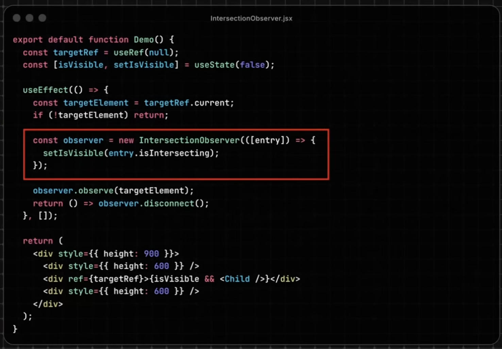

## 11. Server Side Rendering (SSR)

**Traditional Client-Side Rendering**:
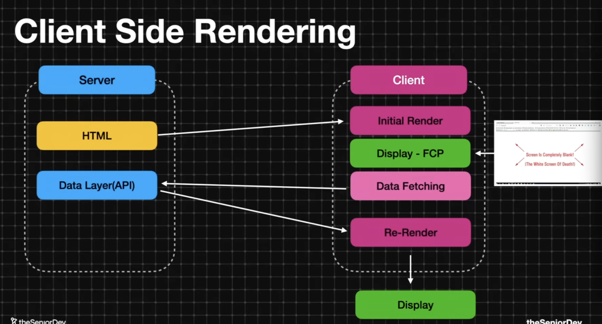

**Problem**: White Screen of Death - users see nothing until JavaScript loads and executes


**Server Side Rendering**:
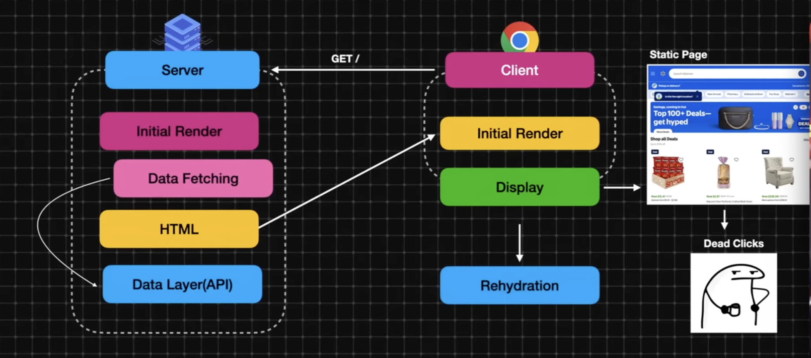

The server pre-renders HTML and sends it to the client. Content is immediately visible, but for a brief moment it's not interactive (dead clicks) until hydration completes.

## 12. Rehydration

The process of attaching event listeners and state to server-rendered HTML, making it interactive.

**How it works**: The client-side JavaScript reconciles the server-rendered HTML with the virtual DOM (Fiber Tree in React), then attaches event handlers and initializes state.

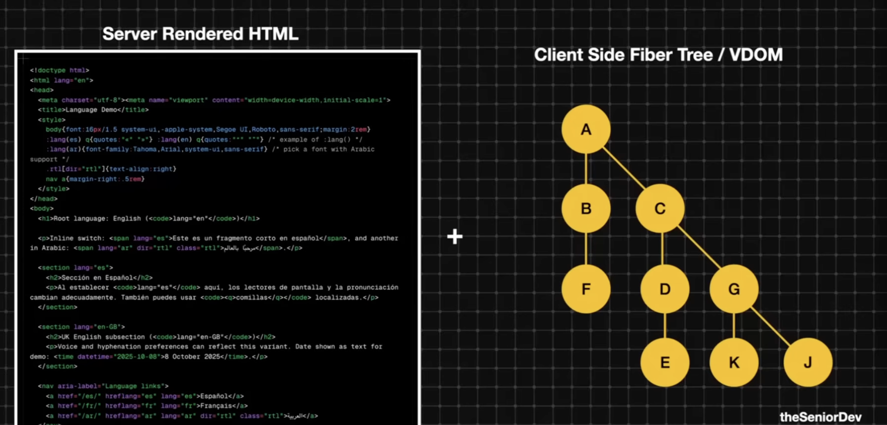
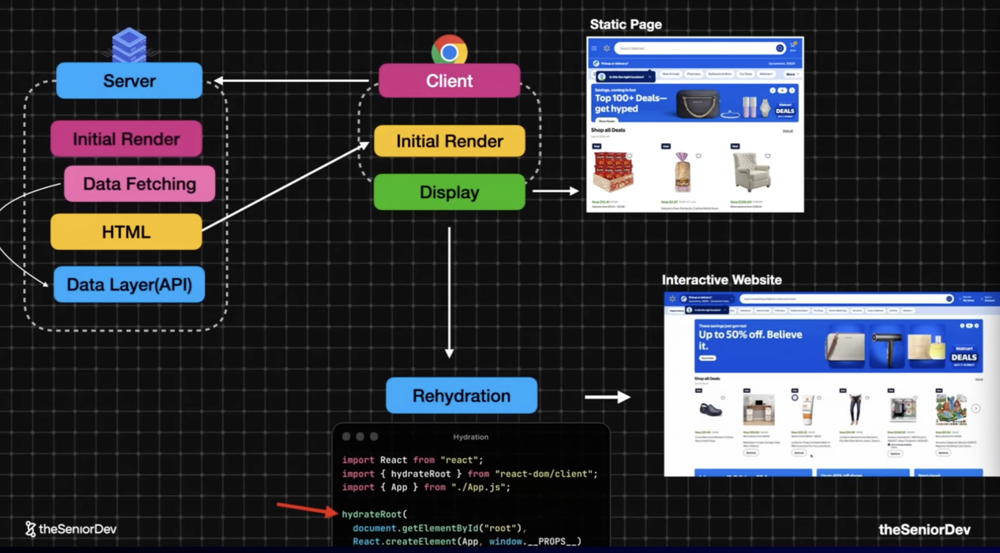

**Hydration Errors** occur when server HTML doesn't match client expectations:

- Random IDs or timestamps
- Browser-only APIs (localStorage, window)
- Different data between server and client

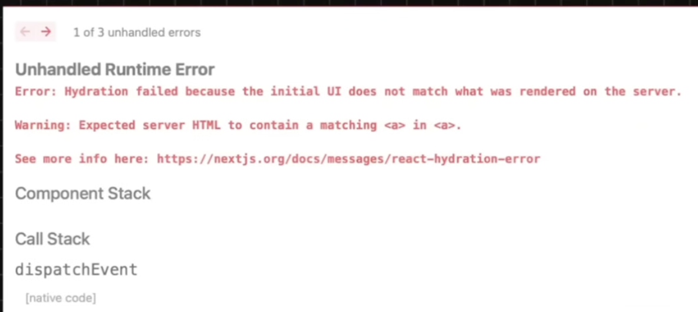

## 13. Partial Pre-Rendering

Combining different rendering strategies on the same page to minimize client-side rendering while preserving interactivity.

**Strategy**: Render as much as possible statically (at build time), and only make necessary components dynamic (SSR/CSR).

**Example**: Blog post with static content + dynamic comments section

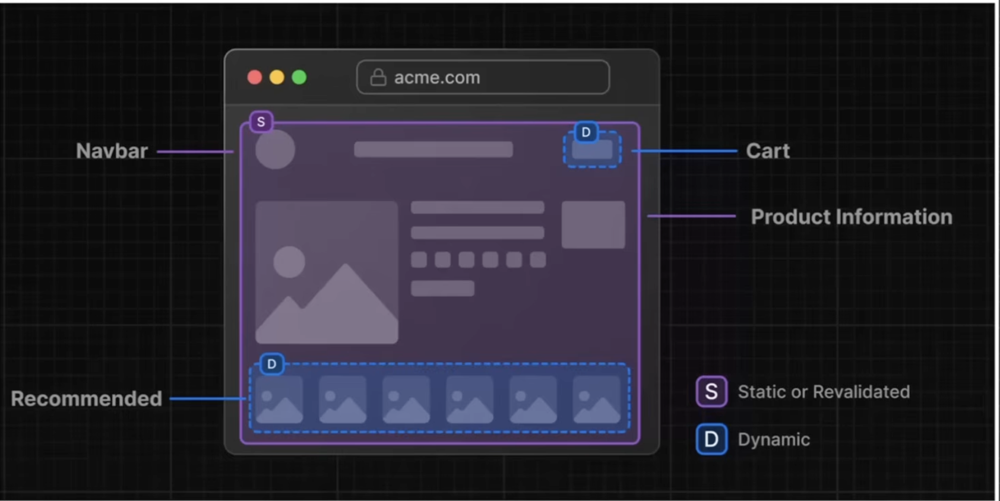

## 14. Server Components

Render non-interactive components entirely on the server and ship only HTML markup.

**Benefits**:

- Zero JavaScript shipped to client for these components
- No hydration needed
- Direct access to backend resources (databases, APIs)
- Reduced bundle size

**Use Cases**: Static content, data fetching, layouts, markdown rendering

**Next.js Example**: Components are server components by default. Add `'use client'` directive only when needed:
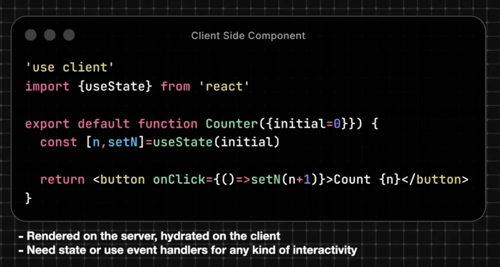

## 15. Microfrontends

Architectural pattern that splits a frontend application into smaller, independently deployable units.

**Benefits**:

- Team autonomy: Different teams work on different features independently
- Technology flexibility: Each microfrontend can use different frameworks
- Independent deployment: Ship features without coordinating releases
- Scalability: Scale development across multiple teams

**Tradeoffs**: Potential performance overhead due to runtime composition, increased complexity, possible code duplication

**Implementation**: Module Federation (Webpack 5), Single-SPA, iframe-based solutions

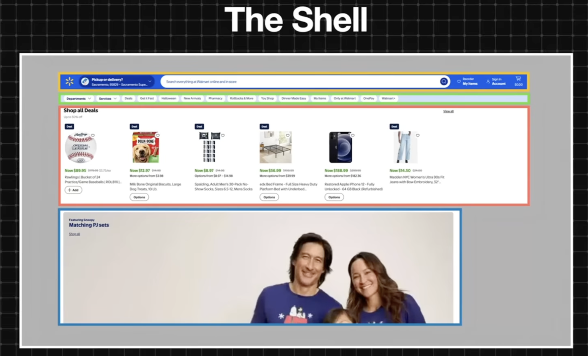

**BFF Pattern (Backend for Frontend)**: Each microfrontend has its own dedicated API layer, optimizing data fetching for specific UI needs.

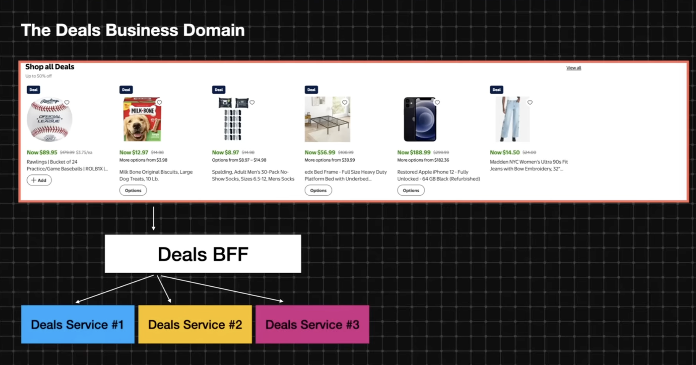
